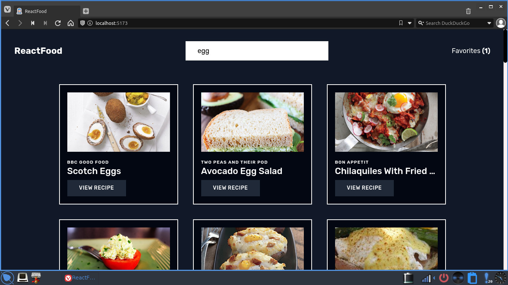
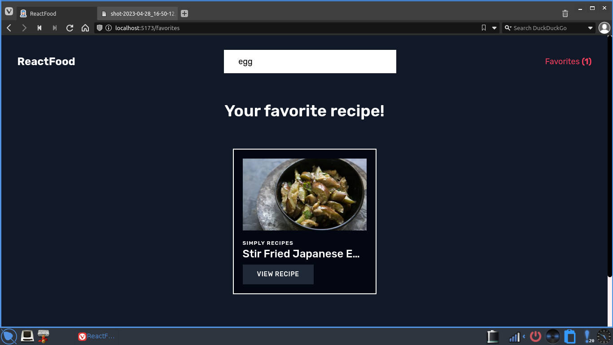
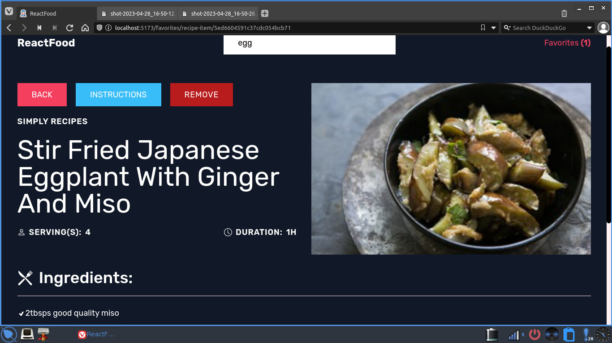

# ReactFood

🍴 Recipe management website for searching and saving recipes locally

ReactFood is a recipe search and management website. You can search for recipes using the Forkify API, view details and save it locally. This project was built with React, Tailwind CSS, and the Vite build tool.

## Screenshots

## Installation

1. Clone the repository: `git clone https://github.com/mehmet-f-dogan/ReactFood.git`
2. Navigate to the project root directory: `cd ReactFood`
3. Install dependencies: `npm install` or `yarn`

## Usage

1. Start a development server: `npm run dev` or `yarn dev`
2. Open the application at `http://localhost:5173`

## Links 🔗

Check out ReactFood live on [portfolio-react-food.mehmetfd.dev](https://portfolio-react-food.mehmetfd.dev/)

## Technologies Used

- React
- Tailwind CSS
- Vite

## Dependencies

- react
- react-icons
- react-router-dom

## Credits

This project uses the Forkify API to search and fetch recipes.

## Version History 📈

The current version of this project is 1.0.0. Check [package.json](https://github.com/mehmet-f-dogan/react-food/blob/master/package.json) for details.
